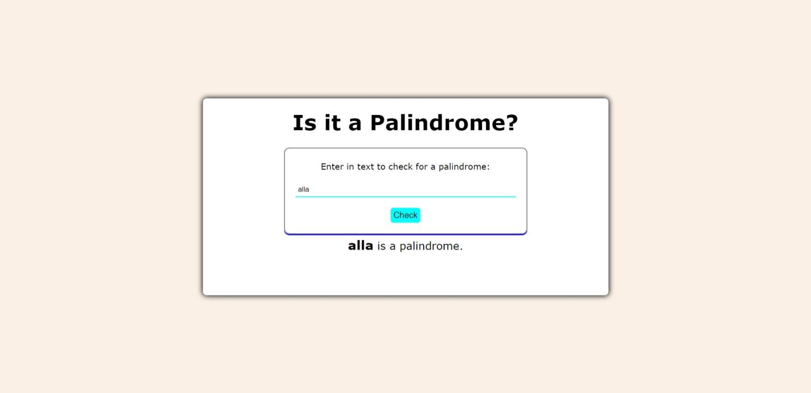

# Palindrome Checker

A palindrome checker is a small web application that checks if a given string is a palindrome. A palindrome is a word, phrase, number, or other sequence of characters that reads the same forward and backward (ignoring spaces, punctuation, and capitalization).

This project is built using HTML, CSS, and JavaScript. It includes the following features:

- An input field to enter the text to be checked.
- A button to initiate the checking process.
- A result area to display the outcome (whether the input text is a palindrome or not).

## Usage

To use the palindrome checker, follow these steps:

1. Open the `index.html` file in your web browser.
2. Enter the text you want to check in the input field.
3. Click the "Check" button.
4. The result will be displayed below the input field.

## Example

Here are some examples of the text you can enter and the expected results:

- Entering "eye" should display "eye is a palindrome".
- Entering "race car" should display "race car is a palindrome".
- Entering "hello" should display "hello is not a palindrome".

## Contributing

If you have any suggestions or improvements for this project, feel free to contribute by creating a pull request.

